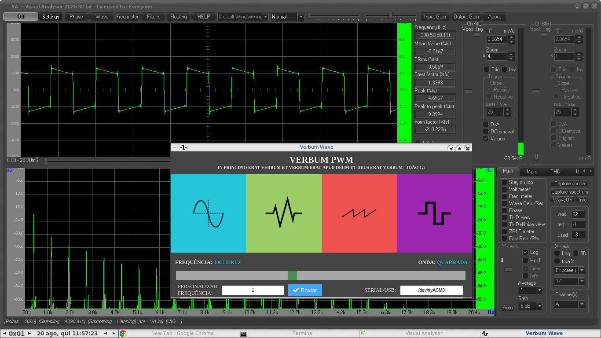

# Verbum PWM

Gerador de sinais / Geração de funções

Olá pessoal, esse é o meu "Verbum PWM", gerador de sinais, está funcionando lindamente xD, tanto ele quanto meu osciloscópio, ambos são de criação "caseira", mas na verdade funcionam perfeitamente. A diferença de uma ferramenta assim, de uma dita profissional, é que a profissional na verdade terá mais funcionalidades, mas essas feitas por mim, também funcionam perfeitamente, apenas contem menos funcionalidades.

O osciloscópio caseiro fiz com alguns resistores, um plug P2 (microfone) e usei o software "Visual Analyser" (rodo ele via wine no Linux) para ver as ondas geradas. No gerador de sinais apenas usei o arduino (UNO) para gerar os pulsos (PWM) utilizando do chip dele em 2 pinos do mesmo, no caso envio esse sinal gerado para as entradas do meu osciloscópio. No caso também o arduino é controlado por essa aplicação Desktop (a comunicação é feita via cabo Serial/USB).

O nome "Verbum" vem numa referência clara a Jesus Cristo, por isso ainda coloquei o verso de João 1,1 em latim ali abaixo do nome xD

### Autor

* **Jessé Silva** - aka - *logoscoder* - [logoscoder.github.io](https://logoscoder.github.io)

